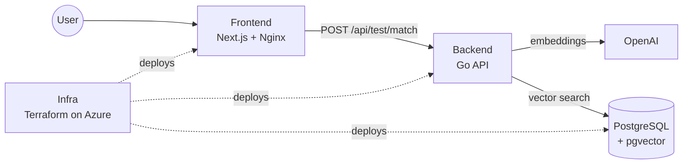
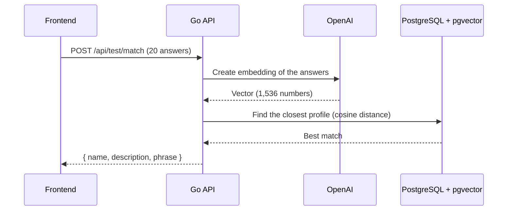

# ¿Qué sos de Gasti? — Backend

> The API of **¿Qué sos de Gasti?**, a 20-question personality quiz that uses AI embeddings to tell you which of Gasti's friends you are most similar to.


## The project

The project is split into three repositories:

| Repository | Role |
|---|---|
| [**Frontend**](https://github.com/GastonFerrarisDavies/QueSosDeGasti-frontend) | Web app where users take the quiz and see their result |
| **Backend** (this repo) | Go API that turns the answers into an AI embedding and finds the closest match |
| [**Infra**](https://github.com/GastonFerrarisDavies/QueSosDeGasti-infra) | Terraform code that creates the Azure cloud environment and deploys the app |



## What this repo does

This is the "brain" of the app. It receives the 20 answers from the [Frontend](https://github.com/GastonFerrarisDavies/QueSosDeGasti-frontend) and returns the person whose profile is most similar.

Instead of fixed scoring rules, it uses **semantic search**:

1. Each friend's profile is converted into an **embedding**, a list of 1,536 numbers that captures the meaning of the text, using OpenAI.
2. These vectors are stored in **PostgreSQL** with the **pgvector** extension.
3. When a user submits the quiz, their answers are turned into a vector the same way.
4. The database finds the closest profile using **cosine distance** and returns it.



## Tech stack

| Area | Technology |
|---|---|
| Language | Go |
| Web framework | Fiber (CORS, logging, panic recovery, graceful shutdown) |
| Database | PostgreSQL 15 + pgvector, accessed with pgx (connection pool with retries) |
| AI | OpenAI Embeddings API (`text-embedding-3-small`) |
| Packaging | Multi-stage Docker build → distroless, non-root image |
| CI | GitHub Actions (`go vet`, `go test`) → GitHub Container Registry (GHCR) |

## API

### `POST /api/test/match`

Receives exactly 20 answers and returns the closest match.

```bash
curl -X POST http://localhost:8080/api/test/match \
  -H "Content-Type: application/json" \
  -d '{"answers": ["...", "...", "... (20 in total)"]}'
```

```json
{ "name": "Emir", "description": "...", "phrase": "..." }
```

| Status | When |
|---|---|
| `200` | Match found |
| `400` | Invalid body, wrong number of answers or empty answers |
| `404` | No profiles loaded yet |
| `502` | OpenAI could not generate the embedding |

### `GET /health`

Returns `{"status":"ok"}` when the API and the database are up.

## Data seeding

The `seed` command (`cmd/seed`) loads the friends' profiles into the database:

- `internal/seed/profiles.json`: the text that gets turned into a vector.
- `internal/seed/descriptions.json`: the description and phrase shown to the user.

It syncs everything in a single transaction: it inserts new people, updates changed ones and removes deleted ones. It is safe to run many times. In production, the [Infra](https://github.com/GastonFerrarisDavies/QueSosDeGasti-infra) deployment runs it automatically after each release.

## Project structure

```
cmd/
├── api/main.go          # API entry point: config, database, routes
└── seed/main.go         # Loads the profiles into the database
internal/
├── config/              # Environment variables
├── database/            # PostgreSQL connection pool
├── embeddings/          # OpenAI client
├── handlers/            # HTTP handlers (+ tests)
├── models/              # Request/response types
├── repository/          # SQL queries (seed + vector search)
└── seed/                # Profile data (JSON)
db/init.sql              # Enables pgvector and creates the tables
Dockerfile               # Go build → distroless runtime
```

## CI/CD

Every push to `main` runs [`.github/workflows/ci.yml`](.github/workflows/ci.yml):

1. **Test:** runs `go vet` and `go test`.
2. **Build:** builds the Docker image and publishes it to GHCR.
3. **Deploy:** writes the new image digest into the [Infra](https://github.com/GastonFerrarisDavies/QueSosDeGasti-infra) repo. That commit triggers the Infra pipeline, which deploys the new version to Azure.

## Run locally

Requirements: Go, Docker and an OpenAI API key.

```bash
# 1. Start PostgreSQL with pgvector (db/init.sql creates the tables)
docker run -d --name quesosdegasti-db -p 5432:5432 \
  -e POSTGRES_USER=gasti -e POSTGRES_PASSWORD=gasti -e POSTGRES_DB=quesosdegasti \
  -v "$(pwd)/db/init.sql:/docker-entrypoint-initdb.d/init.sql:ro" \
  pgvector/pgvector:pg15

# 2. Configure the environment
cp .env.example .env   # set OPENAI_API_KEY and use localhost in DATABASE_URL

# 3. Load the profiles and start the API (with the .env variables exported)
go run ./cmd/seed
go run ./cmd/api       # http://localhost:8080
```

| Variable | Default | Description |
|---|---|---|
| `DATABASE_URL` | — | PostgreSQL connection string |
| `OPENAI_API_KEY` | — (required) | OpenAI API key |
| `EMBEDDING_MODEL` | `text-embedding-3-small` | Embedding model |
| `EMBEDDING_DIMENSIONS` | `1536` | Must match `vector(N)` in `db/init.sql` |
| `ALLOWED_ORIGINS` | — | Allowed CORS origins, e.g. the [Frontend](https://github.com/GastonFerrarisDavies/QueSosDeGasti-frontend) URL |

> If you change the embedding model or its dimensions, update `db/init.sql`, recreate the tables and run the seed again. Vectors from different models can't be compared.
